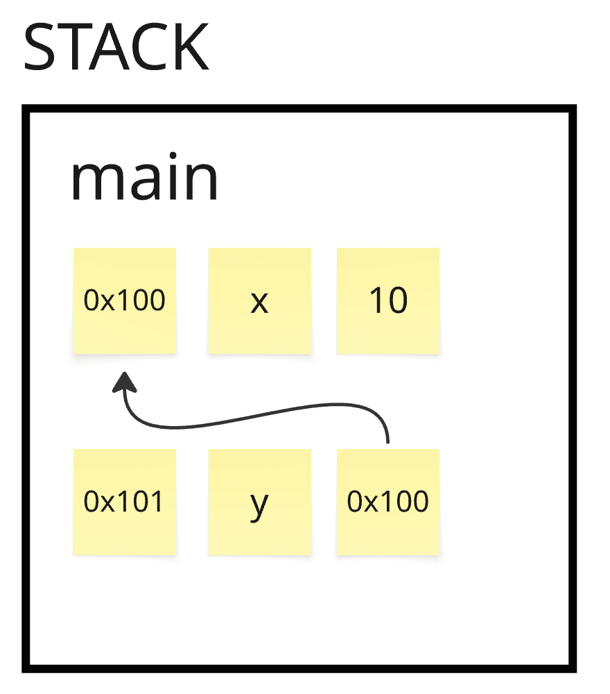

# Rust memory

## What Rust Is Actually Protecting You From?
Rust is not trying to stop your program from crashing.
It is trying to prevent undefined behavior (UB).

### Undefined Behavior in Rust
Undefined behavior means the program has entered a state where the language no longer defines what happens. At that point, anything is allowed: crashes, silent data corruption, security vulnerabilities, or seemingly correct behavior that breaks later.

Rust’s definition of undefined behavior is stricter than C and C++.

In C/C++, many invalid programs are treated as “the programmer’s responsibility” and may appear to work depending on the compiler or platform. Rust explicitly forbids these situations. If they occur, the program is considered invalid, even if it seems to run correctly.

Examples of undefined behavior include:
- Accessing memory after it has been deallocated
- Accessing memory outside the bounds of an allocation
- Interpreting memory as a value that does not match its type
- Mutating memory while it is simultaneously accessed in an incompatible way
- Concurrently accessing the same memory from multiple threads without proper synchronization

These are not “bugs that might cause problems.”. They are states the compiler assumes will never happen.


### Why Rust enforces guarantees at compile time
Because once undefined behavior exists, reasoning about the program becomes impossible.

The guarantees exist to:
- Eliminate entire classes of security vulnerabilities
- Allow the compiler to assume the program is valid and optimize aggressively
- Ensure that code behavior is predictable and portable

Performance is a consequence, not the goal. The real goal is soundness: the compiler must be allowed to trust the program.


### Memory safety, data races and memory leaks
These terms are often confused. They are not the same thing.

#### Memory safety
Means the program only:
- Accesses memory that is valid
- Uses memory according to its type
- Respects the lifetime of allocations
- Respects aliasing rules

Violating any of these leads to undefined behavior.

#### Data races
A specific form of UB that occur when:
- Multiple threads access the same memory
- At least one access is a write
- There is no synchronization

Rust treats data races as undefined behavior and prevents them by construction.

#### Memory leaks
A memory leak means allocated memory is never released.
This is allowed in Rust because leaking memory does not create an invalid state. The memory remains allocated and valid; it is simply never reclaimed.
Rust prioritizes correctness over resource cleanup.


### What safety means in Rust
Safety in Rust does not mean: no crashes, no bugs or no logic errors.
Safety means the program cannot enter an invalid state as defined by the language.

If a Rust program crashes, it is still safe.
If it invokes undefined behavior, it is not.

Rust’s entire design is built around making invalid states unrepresentable.


## Rust Memory Model
[How to think about memory](#Memory)

Stack contains plain bytes. Those bytes can encode a value (eg. 10) or memory address as hex (eg. 0x100). 
Pointer is a value that stores a memory address. Stack does not know it points to the heap/stack. Stack/heap does not know who points to it.
CPU just follows addresses.

### Stack vs heap
Data is stored either on stack or on the heap.
Both represent just regions of computer's RAM.

**Stack**
- Stack is a pool of bytes in RAM organized into frames
- Frame corresponds to function scope, code blocks (`{}`). 
- When function finishes its execution, the frame is deallocated.
- Deallocation is automatic and implicit.
- Fixed-size values (int, float, bool, char) can be stored directly on the stack.
```
+------------------+
| ptr = 0x7ffd1234 |  <-- just a number as hex
+------------------+
```

**Heap**
- Heap is a big pool of bytes in RAM. It stores contiguous chunks of bytes. Heap has no organization like frames in stack.
- `Box` allocates some number of bytes on the heap and stores the resulting pointer on the stack, and knows how to deallocate those bytes later
- Vec, String also allocate on the heap, when the capacity of current memory location is exceeded for Vec/String, the data gets copied, allocated on the new memory location with greater capacity, and freed from current memory location.
- Heap data has no inherent lifetime: it is deallocated when value responsible for freeing it gets dropped
- Heap deallocation is explicit and deliberate (via `drop`)
```
[ A | B | C | _ | _ | _ | _ | _ ]
```
Let's say A is under address `0x7ffd1234`


**Fixed-size data**
- Data that has size known at compile time, eg. `i32` or `[u8; 32]`, or structs with fixed fields

**Dynamically-sized data**
- Data that size is not known at compile time, eg. `str`, `[T]`

### What going out of scope physically means
Variable / frame going out of scope means that the stack frame is popped and memory becomes available for reuse. Popped means that stack pointer is moved back and memory is considered free for reuse.

### What drop actually does
- Runs destructor code (`Drop::drop`)
- Releases owned resources (heap memory, file handles, locks, etc.)

### Why heap memory must have one deallocator
- Issue of double free or mismatched alloc/free happening
- Freeing memory twice -> freeing memory you don't own -> allocator metadata corruption
- Heap memory must be freed exactly once to keep allocator state consistent


---

## Ownership: The Single-Owner Rule
**Ownership** defines which binding is responsible for dropping the value regardless of where it lives (stack, heap, in struct, etc.).
It governs destruction, not memory location.
Examples:
```rust
{
    let x = String::from("hi"); // heap allocation
} // drop(x) runs here

{
    let y = vec![1, 2, 3]; // heap allocation
} // drop(y) runs here

{
    let z = std::fs::File::open("foo.txt").unwrap();
} // no heap memory, but OS resource is released

```

By default, transferring a value to another binding/function moves ownership and invalidates the source.
Move occurs when a variable does not implement the copy trait, and the operation would cause duplication of the value.
Usually move occurs on when a variable owning heap location is:
- Assigned to other variable
- Passed to function as argument
- Returned from a function

```rust
fn main() {
  let x = String::from("Ferris");
  let y = x;
  println!("{x}");  // ❌ Invalid: ownership moved, Rust prevents future usage
}
```
Rust enforces the rule of one owner per value at compile time.


**Copy trait**
The exception to this rule is the copy trait.
A data structure that implements copy trait does not perform move in cases described above.
Instead, memory bits are duplicated on the stack.

```rust
fn main() {
    let x = 10;
    let y = x;
}

```
What happened in memory:
```
          STACK
+-----------------------+
| Address | Name | Val  |
+---------+------+------+
| 0x0001  |  x   |  10  |  <-- Original bits
+---------+------+------+
| 0x0002  |  y   |  10  |  <-- A physical copy of those bits
+---------+------+------+
```
These are `Copy`:
- `i32`
- `bool`
- `(f64, i32)`
- `&String`

These are not:
- `String`
- `Vec<T>`
- `Box<T>`

Developer can make explicit choice to not pass ownership to another variable by cloning the original value and passing the clone instead.
Clone should not generally be the default option, because it allocates more memory.
However, there can be situations where cloning may be acceptable choice.


---

## Why Aliasing and Mutation Is the Root Problem?
Aliasing a memory location means creating an additional live access path to the same memory location where original variable points.
By creating an alias we create additional way for a program to access memory location.

**Example: Undefined Behavior as a result of reallocation**
Creating an alias for the 2-nd to 4-th letter of "Ferris" would look like this:
```
                STACK
+--------------------------------+              +--------------------+
| Address |  Name |      Val     |              | Address |    Val   |  
+---------+-------+--------------+              +--------------------+
| 0x0001  |   s   |    0x00010   | ---------->  | 0x00010 |    F     |
+---------+-------+--------------+              |         |    e     |----+
| 0x0002  | alias | 0x00010[1:3] |  -----+      |         |    r     |----+
+---------+-------+--------------+       |      |         |    r     |----+
                                         |      |         |    i     |    |
                                         |      |         |    s     |    |
                                         |      +--------------------+    |
                                         |________________________________|
```

This is fine until both of the values (`s` and `alias`) are read only. The problem starts when at least one of them is mutable.
Mutating a string by eg. pushing an additiona string to `s` can lead to exceeding memory capacity at 0x00010. As a consequence, the memory content
will be copied to another location with greater capacity and original memory address may be freed and later reused.
In consequence, `alias` will be pointing to a location that got deallocated and can be empty or contain garbage - this is UB.


Pointer Safety Principle states: data should never be aliased and mutated at the same time.

Variables do not matter, because they just point to a location in memory. What matters actually what is in this memory location.

--- 

## Borrowing: Temporary Access Without Ownership
Knowing that passing a variable to a function or assigning it to other variable moves the ownership it creates a problem: whenever we want 
to use a variable we have to move it. It becomes tedious because we have one of three options for doing so:
- Passing a variable to a function and returning it (tedious)
- Passing a clone of variable and do processing on a clone (consumes additional memory)

Borrowing is the mechanism that solves this problem. It allows to "borrow" a variable without taking the ownership of it.
After the last time the reference (borrow) is used, the right to use that data is returned to the original variable.

To fix the "Own" permission confusion, you must distinguish between the **container** (the pointer variable `y`) and the **content** (the data `*y`). If you say `y` has **O** permissions without qualifying it, you are implies `y` can deallocate the memory it points to, which is a lie.

Here is the technically corrected breakdown of how permissions actually shift.

---

### Non-owning pointer (The Permission Reality)

Borrowing doesn't just change permissions on one "variable"; it splits permissions between the **Reference Variable** (the pointer) and the **Referent** (the data being pointed to).

#### 1. Immutable Borrow (`let y = &x;`)

* **Original Variable (`x`):** Loses **W** and **O**. It can still be read (**R**), but it cannot be changed or moved because the borrow `y` relies on `x` staying exactly where and how it is.
* **Reference Variable (`y`):** Gains **R** and **O**. You own the pointer. You can move `y`, copy `y`, or let `y` die.
* **Referent (`*y`):** Gains **R**. Through `y`, you can only read the data.

#### 2. Mutable Borrow (`let y = &mut x;`)

* **Original Variable (`x`):** Loses **R, W, and O**. It is completely "locked." You cannot even look at `x` while `y` is active.
* **Reference Variable (`y`):** Gains **R** and **O**. Again, you own the pointer itself.
* **Referent (`*y`):** Gains **R** and **W**. Through `y`, you can read and modify the data.

### The Permission Transition Table
```
|    Entity     | Permission before Borrow | Permission during &x  | Permission during &mut x    |
| ------------- + ------------------------ + --------------------- + --------------------------- |
| Owner (x)     | R, W, O                  | R (W/O suspended)     | None (R/W/O suspended)      |
| Pointer (y)   | N/A                      | R, O (on the address) | R, O (on the address)       |
| Data (*y)     | R, W (via x)             | R                     | R, W                        |
```

### Why this distinction matters

If you don't separate `y` from `*y`, you won't understand **Reborrowing**.
When you have a `y: &mut T`, you can't *move* the data out of it (because you don't have **O** on `*y`), but you can *re-borrow* it. You are passing the **R/W** permissions further down the chain while your own access is temporarily suspended.

---

### Borrow visualization

```rust
let x = 10;
let y = &x;
```
- `y` stores literally the address of `x`
- Refering to `y` means refering to the value of address
- `assert_eq!(x, *y)`





### Why borrow removes permissions?
- (Immutable borrow) Borrowing removes O from original variable so that only one variable at a time has O permissions on the memory space (single deallocator).
- (Immutable borrow) Borrowing removes W from original variable so that when a vector is borrowed we can't push to it to invalidate the space to which borrowed variable points.
- (Mutable borrow) To prevent UB when there is an alias + mutation allowed on the same memory location in the same time

### Permissions exist only in compiler
Permissions are only evaluated at compile time and are not checked on runtime. This ensures that the program that went through compiler
is safe (no UB) and the runtime can assume safety and don't bother (increased performance).

---


# Known unknowns
- Does Rust prevent accessing memory that was deallocated, or even having a pointer to that location?

# Memory
**Thin pointer pointing to the stack**
```rust
fn main() {
    let x: i32 = 42;      // Lives on the stack
    let p: &i32 = &x;   // A pointer on the stack, pointing to x on the stack
}
```

```
           STACK
+---------------------------+
| Address | Name |   Val    |
+---------+------+----------+
| 0x0001  |  x   |    42    |
+---------+------+----------+
| 0x0002  |  p   |  0x0001  | 
+---------+------+----------+
```

**Thin pointer pointing to the heap**
```rust
fn main() {
    let x = Box::new(10);
    let p = &x;
}

```


```
             STACK                         HEAP
+---------------------------+            +---------+-----+
| Address | Name |   Val    |            | Address | Val |
+---------+------+----------+            +---------+-----+
| 0x0001  |  p   |  0x00011 |  --------> | 0x00011 |  10 |
+---------+------+----------+            +---------+-----+
```

**Fat pointer to the stack (because `arr` is fixed size)**
```rust
fn main() {
    let arr: [i32; 3] = [10, 20, 30]; // Fixed-size array on the STACK
    let slice: &[i32] = &arr[..];      // FAT POINTER on the STACK
}
```

```
               STACK
+---------------------------------+
| Address |   Name     |   Val    |
+---------+------------+----------+
| 0x0001  |   arr[0]   |    10    |
|         |   arr[1]   |    20    |
|         |   arr[2]   |    30    |
+---------+------------+----------+
| 0x0002  | slice.ptr  |  0x0001  | 
|         | slice.len  |     3    | 
+---------+------------+----------+
```


**Struct has more than two attributes**
Examples: Vect, Str
```
+------------------+
| ptr = 0x7ffd1234 |
| len = 3          |
| cap = 8          |
+------------------+
+-------------------------------+
| Address | Name     |   Val    |
+---------+----------+----------+
| 0x0001  |  s.ptr   |    42    |
|         |  s.len   |     3    |
|         |  s.cap   |     8    |
+---------+----------+----------+
```
